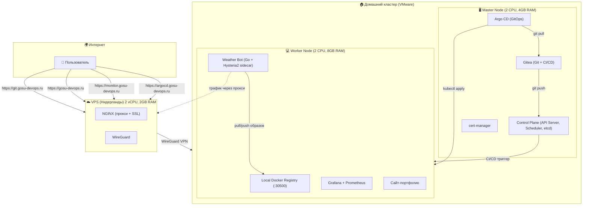

# ☁️ Weather Scanner Bot — DevOps пет-проект

Привет! Это мой pet-проект, который я делал (конечно не без помощи AI инструментов), чтобы пройти полный цикл разработки и развертывания приложения. В итоге получилась живая, работающая инфраструктура.

Доступы к просмотру репозитория Gitea и дашбордов в Grafana можете запросить у меня в тг [@fav0r1te_ai](https://t.me/fav0r1te_ai)

P.S. Проектные сайты и сам бот [@AirQuality174Bot](https://t.me/AirQuality174Bot) работают только тогда, когда запущена кластерная машина, не всегда могу держать её включенной, поэтому лучше в личку стучитесь, так же можно скриншотики по проекту поглядеть [ТЫК СЮДА](https://drive.google.com/drive/folders/1PDYeVF1VZBX8FKshWwcFUGb0JsVOdTub?usp=sharing)

---

## 🤔 Что это за проект?

Это Telegram-бот, который показывает погоду по запросу `/weather <город>`. Но сам бот — лишь вершина айсберга. Главное здесь — инфраструктура, на которой он работает.

Проще говоря, я превратил обычный компьютер с Linux в свой собственный "мини-интернет", где есть:

- **Git-сервер (Gitea)** — мой личный GitHub, где лежит код.
- **CI/CD (Gitea Actions)** — при пуше код автоматически собирается и деплоится.
- **GitOps (Argo CD)** — всё состояние кластера в Git, автоматическая синхронизация.
- **Мониторинг (Prometheus + Grafana)** — я вижу состояние бота и всего кластера.
- **Приватный Docker Registry** — место, где хранятся мои образы.
- **Доступ из интернета** — все сервисы доступны по HTTPS с настоящими сертификатами.

---

## 🏗️ Архитектура

## ⚙️ Как это работает

1. **Разработчик (я)** пушит код в Gitea (`git.gosu-devops.ru`).

2. **Gitea Runner** (который работает прямо в кластере) видит push и запускает пайплайн:
   - Собирает новый Docker-образ.
   - Пушит его в локальный реестр (`registry:30500`).
   - Выполняет `kubectl rollout restart`, и в кластере обновляется под с ботом.

3. **Argo CD** отслеживает репозиторий и автоматически синхронизирует состояние кластера с манифестами в Git.

4. **Пользователь** пишет боту в Telegram `/weather Moscow`.

5. **Бот** через Hysteria2-прокси отправляет запрос к WeatherAPI.com и возвращает ответ.

6. **Prometheus** собирает метрики (число запросов, ошибки, время ответа), а я смотрю на них в **Grafana**.

---

## 🗺️ Мой путь: от одной виртуалки до production-кластера

### 1. Старт: всё на одной виртуалке
Сначала я просто хотел развернуть бота. Поставил Docker, GitLab, K3s — всё на одну машину. Это работало, но было похоже на игрушку. Никакого разделения, всё в одной куче, плюс GitLab на слабой ВМ сильно тормозил.

### 2. "Взрослый" Kubernetes: Kubespray + Master + Worker
Это был самый сложный и интересный этап. Я решил, что хочу настоящий кластер, как в продакшене.

- **Чистые VM**: Создал две виртуалки с Ubuntu Server (2vCPU/4GB и 2vCPU/8GB).
- **Kubespray**: С помощью Ansible развернул production-кластер Kubernetes.
- **Миграция**: Перенес код из старого GitLab в новый Gitea и GitHub.

### 3. Ansible: автоматизация пост-настройки
После установки кластера написал собственные Ansible-роли для автоматизации:

- **docker** — настройка insecure registry для локального Docker Registry.
- **containerd** — конфигурация containerd для работы с приватным registry.
- **gitea-runner** — автоматическая установка, регистрация и запуск Gitea Runner на worker-ноде.

Все роли идемпотентны (можно запускать много раз без побочных эффектов). Один плейбук настраивает worker-ноду за 2 минуты.

### 4. Git-сервер: Gitea вместо GitLab
GitLab на 4GB RAM работал ужасно. Нашел легковесную альтернативу — **Gitea**. Она отлично работает на 2GB RAM, а по возможностям (Git, CI/CD, Actions) почти не уступает.

- **CI/CD**: Настроил пайплайны в `.gitea/workflows/`, которые при пуше в `test` или `main` автоматически деплоят обновления.

### 5. Обход блокировок: Hysteria2 как sidecar-контейнер
Telegram в России блокируют, поэтому бот не мог достучаться до API. Решение — **Hysteria2**.

- **VPS**: Арендовал самый дешевый VPS в Нидерландах.
- **Сервер Hysteria2**: Поднял за 5 минут по готовой инструкции.
- **Sidecar**: Добавил в под бота дополнительный контейнер `hysteria`, который поднимает SOCKS5-прокси и пускает через него трафик бота.

### 6. Локальный Container Registry
Чтобы не зависеть от внешних реестров, поднял свой локальный registry прямо в кластере на порту `30500`. CI/CD пушит туда образы, а kubelet их оттуда забирает. Всё быстрее и под контролем.

### 7. Доступ из интернета: WireGuard + NGINX + Let's Encrypt
Последний рывок, чтобы мои сайты стали доступны всем.

- **WireGuard**: Поднял VPN-туннель между домашним кластером и VPS. Домашний сервер сам подключается к VPS, не нужно открывать порты на роутере.
- **NGINX на VPS**: Настроил проксирование на WireGuard-адрес домашнего кластера (`10.10.10.2`).
- **SSL**: Для портфолио и Grafana использовал `cert-manager` (Let's Encrypt). Для Gitea поставил `certbot` прямо на VPS. Теперь всё по HTTPS.

### 8. Мониторинг: kube-prometheus-stack
Поставил стандартный стек: Prometheus собирает метрики, Grafana показывает. В код бота добавил кастомные метрики:

- `weather_bot_requests_total` — количество запросов
- `weather_bot_errors_total` — ошибки
- `weather_bot_request_duration_seconds` — время ответа

Теперь в Grafana вижу, как часто ботом пользуются и нет ли ошибок.

### 9. GitOps: Argo CD

После того как весь стек заработал, я добавил **GitOps** в свой кластер с помощью **Argo CD**. Теперь всё состояние кластера хранится в Git и синхронизируется автоматически.

- **GitOps**: Все манифесты Kubernetes хранятся в репозитории `https://git.gosu-devops.ru/gosu/devops.git`
- **Argo CD**: Установлен внутри кластера и доступен по адресу `https://argocd.gosu-devops.ru`
- **Автоматическая синхронизация**: При пуше в `main` Argo CD сам применяет изменения
- **Визуальный контроль**: Через Web UI вижу статус всех приложений

---

## 🛠️ Технологический стек

| Категория | Технологии |
|-----------|------------|
| **IaC** | Kubespray, Ansible (собственные роли), Helm, Git |
| **CI/CD** | Gitea Actions |
| **GitOps** | Argo CD |
| **Контейнеризация** | Docker, Kubernetes (Kubespray, Flannel) |
| **Сеть и туннели** | Hysteria2, WireGuard, NGINX, Let's Encrypt |
| **Языки** | Go 1.23, Python |
| **Приложения** | Gitea, Argo CD, Prometheus, Grafana |

---

## 🌐 Сервисы и доступ

| Сервис | Адрес | Назначение |
|--------|-------|-------------|
| **Gitea** | `https://git.gosu-devops.ru` | Git-репозитории, CI/CD |
| **Argo CD** | `https://argocd.gosu-devops.ru` | GitOps, управление кластером |
| **Grafana** | `https://monitor.gosu-devops.ru` | Мониторинг |
| **Портфолио** | `https://gosu-devops.ru` | Сайт-визитка |
| **Weather Bot** | Telegram | Бот погоды |
| **Docker Registry** | `192.168.181.134:30500` | Локальное хранилище образов |

---

## ✅ Что сейчас работает

| Компонент | Статус | Адрес |
|-----------|--------|-------|
| **Kubernetes** | ✅ 2 ноды (master + worker) | `192.168.181.133`, `192.168.181.134` |
| **Gitea + Actions** | ✅ Репозиторий, CI/CD | `https://git.gosu-devops.ru` |
| **Argo CD** | ✅ GitOps, синхронизация | `https://argocd.gosu-devops.ru` |
| **Grafana + Prometheus** | ✅ Мониторинг | `https://monitor.gosu-devops.ru` |
| **Weather Bot** | ✅ Деплой, метрики | Telegram `@AirQuality174Bot` |
| **Docker Registry** | ✅ Локальное хранилище | `192.168.181.134:30500` |
| **WireGuard VPN** | ✅ Туннель VPS ↔ кластер | `10.10.10.2` |

---

## 🚀 Как запустить у себя (кратко)

1. **Подготовить две VM** с Ubuntu Server.
2. **Настроить SSH-доступ** между ними.
3. **Установить Kubespray** на одной из них и выполнить плейбук. Через 20 минут у вас будет кластер.
4. **Установить Gitea** (через Helm или Docker) и **Gitea Runner**.
5. **Установить Argo CD** (через Helm или официальные манифесты).
6. **Написать Ansible-роли** для пост-настройки узлов (или использовать мои).
7. **Поднять Hysteria2 сервер** на VPS.
8. **Настроить WireGuard** и NGINX на VPS.
9. **Применить манифесты** из репозитория (`k8s/`, `cert-manager/`, `argocd/`).

---

**✨ Pet-проект 2026** | [GitHub](https://github.com/EvgeniyGOSU) | [Telegram](https://t.me/fav0r1te_ai)
