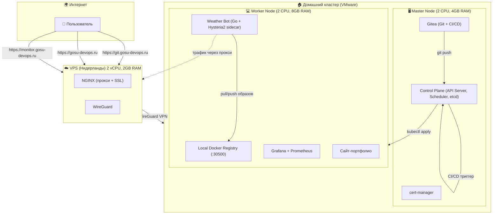

# ☁️ Weather Scanner Bot — DevOps пет-проект

Привет! Это мой pet-проект, который я делал, чтобы пройти полный цикл разработки и развертывания приложения. В итоге получилась живая, работающая инфраструктура.

---

## 🤔 Что это за проект?

Это Telegram-бот, который показывает погоду по запросу `/weather <город>`. Но сам бот — лишь вершина айсберга. Главное здесь — инфраструктура, на которой он работает.

Проще говоря, я превратил обычный компьютер с Linux в свой собственный "мини-интернет", где есть:

*   **Git-сервер (Gitea)** — мой личный GitHub, где лежит код.
*   **CI/CD (Gitea Actions)** — при пуше код автоматически собирается и деплоится.
*   **Мониторинг (Prometheus + Grafana)** — я вижу состояние бота и всего кластера.
*   **Приватный Docker Registry** — место, где хранятся мои образы.
*   **Доступ из интернета** — все сервисы доступны по HTTPS с настоящими сертификатами.

---

## 🏗️ Архитектура



---

## ⚙️ Как это работает

1.  **Разработчик (я)** пушит код в Gitea (`git.gosu-devops.ru`).

2.  **Gitea Runner** (который работает прямо в кластере) видит push и запускает пайплайн:
    *   Собирает новый Docker-образ.
    *   Пушит его в локальный реестр (`registry:30500`).
    *   Выполняет `kubectl rollout restart`, и в кластере обновляется под с ботом.

3.  **Пользователь** пишет боту в Telegram `/weather Moscow`.

4.  **Бот** через Hysteria2-прокси отправляет запрос к WeatherAPI.com и возвращает ответ.

5.  **Prometheus** собирает метрики (число запросов, ошибки, время ответа), а я смотрю на них в **Grafana**.

---

## 🗺️ Мой путь: от одной виртуалки до production-кластера

### 1. 🚀 Старт: всё на одной виртуалке
Сначала я просто хотел развернуть бота. Поставил Docker, GitLab, K3s — всё на одну машину. Это работало, но было похоже на игрушку. Никакого разделения, всё в одной куче, плюс GitLab на слабой ВМ сильно тормозил.

### 2. ➡️ "Взрослый" Kubernetes: Kubespray + Master + Worker
Это был самый сложный и интересный этап. Я решил, что хочу настоящий кластер, как в продакшене.

*   **Чистые VM**: Создал две виртуалки с Ubuntu Server (2vCPU/4GB и 2vCPU/8GB).
*   **Kubespray**: С помощью Ansible развернул production-кластер Kubernetes.
*   **Миграция**: Перенес код из старого GitLab в новый Gitea и GitHub.

### 3. 🐙 Git-сервер: Gitea вместо GitLab
GitLab на 4GB RAM работал ужасно. Нашел легковесную альтернативу — **Gitea**. Она отлично работает на 2GB RAM, а по возможностям (Git, CI/CD, Actions) почти не уступает.

*   **CI/CD**: Настроил пайплайны в `.gitea/workflows/`, которые при пуше в `test` или `main` автоматически деплоят обновления.

### 4. 🌐 Обход блокировок: Hysteria2 как sidecar-контейнер
Telegram в России блокируют, поэтому бот не мог достучаться до API. Решение — **Hysteria2**.

*   **VPS**: Арендовал самый дешевый VPS в Нидерландах.
*   **Сервер Hysteria2**: Поднял за 5 минут по готовой инструкции.
*   **Sidecar**: Добавил в под бота дополнительный контейнер `hysteria`, который поднимает SOCKS5-прокси и пускает через него трафик бота.

### 5. 📦 Локальный Container Registry
Чтобы не зависеть от внешних реестров, поднял свой локальный registry прямо в кластере на порту `30500`. CI/CD пушит туда образы, а kubelet их оттуда забирает. Всё быстрее и под контролем.

### 6. 🔒 Доступ из интернета: WireGuard + NGINX + Let's Encrypt
Последний рывок, чтобы мои сайты стали доступны всем.

*   **WireGuard**: Поднял VPN-туннель между домашним кластером и VPS. Домашний сервер сам подключается к VPS, не нужно открывать порты на роутере.
*   **NGINX на VPS**: Настроил проксирование на WireGuard-адрес домашнего кластера (`10.10.10.2`).
*   **SSL**: Для портфолио и Grafana использовал `cert-manager` (Let's Encrypt). Для Gitea поставил `certbot` прямо на VPS. Теперь всё по HTTPS.

### 7. 📊 Мониторинг: kube-prometheus-stack
Поставил стандартный стек: Prometheus собирает метрики, Grafana показывает. В код бота добавил кастомные метрики:

*   `weather_bot_requests_total` — количество запросов
*   `weather_bot_errors_total` — ошибки
*   `weather_bot_request_duration_seconds` — время ответа

Теперь в Grafana вижу, как часто ботом пользуются и нет ли ошибок.

---

## 🛠️ Технологический стек

| Категория | Технологии |
|-----------|------------|
| **IaC** | Kubespray, Helm, Git |
| **CI/CD** | Gitea Actions |
| **Контейнеризация** | Docker, Kubernetes (Kubespray, Flannel) |
| **Сеть и туннели** | Hysteria2, WireGuard, NGINX, Let's Encrypt |
| **Языки** | Go 1.23, Python |
| **Приложения** | Gitea, Prometheus, Grafana |

---

## 🌐 Сервисы и доступ

| Сервис | Адрес | Назначение |
|--------|-------|-------------|
| **Gitea** | `https://git.gosu-devops.ru` | Git-репозитории, CI/CD |
| **Grafana** | `https://monitor.gosu-devops.ru` | Мониторинг (логин: admin, пароль: prom-operator) |
| **Портфолио** | `https://gosu-devops.ru` | Сайт-визитка |
| **Weather Bot** | Telegram | Бот погоды |
| **Docker Registry** | `192.168.181.134:30500` | Локальное хранилище образов |

---

## 🚀 Как запустить у себя (кратко)

1.  **Подготовить две VM** с Ubuntu Server.
2.  **Настроить SSH-доступ** между ними.
3.  **Установить Kubespray** на одной из них и выполнить плейбук.
4.  **Установить Gitea** (через Helm или Docker) и **Gitea Runner**.
5.  **Поднять Hysteria2 сервер** на VPS.
6.  **Настроить WireGuard** и NGINX на VPS.
7.  **Применить манифесты** из репозитория (`k8s/`, `cert-manager/`).

Подробно все шаги описаны в процессе создания этого проекта.

---

**✨ Pet-проект 2026** | [GitHub](https://github.com/EvgeniyGOSU) | [Telegram](https://t.me/fav0r1te_ai)
```
